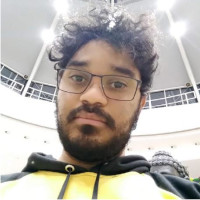

# Morse Code AI Interpreter

Copyright 2022, Claudinei de Oliveira, Guilherme Matheus Rafael Parcerão & Renan Bernardo dos Santos. Licensed under GNU General Public License version 3.0. Review the LICENSE file for further details.

## Introduction

Morse Code AI Interpreter is an automatic interpreter for messages typed in the Morse Code via an AI software, using as reference a database of .CSV archives for recognize the patterns in each alphabet letter. It reads the message based in time duration of electric pulses read by an ESP32 microcontroller.

The project was made as part of the semestral project in SENAI Technology College "Mariano Ferraz" as requirement for course approval and subsequent obtaining of the Specialist in Internet of Things title in the Internet of Things Graduate Program.

## Suported Targets

The project was tested on the following devices:

| ESP32 | ESP32-S2 |
| ----- | -------- |

Currently, tests are being made on the following devices:

| RP2040 | K210 | STM32C0 | STM32H7 |
| ------ | ---- | ------- | ------- |

## Instructions

Each folder has the code for a single component of the project, which together make the project work, each one responsible for a step of the project.

- letters_capture: PlatformIO project. Load into an ESP32 with an button to capture the letters Morse Code and send to the PC via serial.
- letters_csv_writer: Python project. Execute on PC while executing letters_capture on ESP32, so the letters Morse Code can be captured into a CSV file.
- ML_training: Jupyter Notebook project. Use the CSV files generated on the anterior steps to train the neural network and generate the C array file for the translator.
- morse_translator: PlatformIO project. The trained neural network is loaded on the ESP32 to do the translation.

## See the project working

## Developers

Claudinei de Oliveira

[GitHub](https://github.com/cldnei)

Guilherme Parcerão

[GitHub](https://github.com/gmrparcerao) | [LinkedIn](https://www.linkedin.com/in/guilherme-parcerao/)

Renan Bernardo

[GitHub](https://github.com/b3rnardo) | [LinkedIn](https://www.linkedin.com/in/b3rnardo/)
